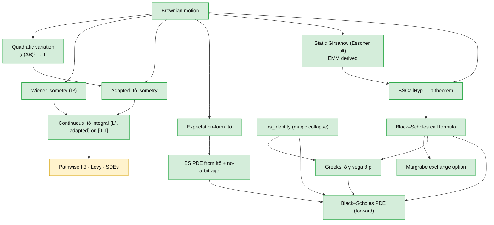

# Blueprint — the deductive spine

How option-pricing theory is built here, starting from Brownian motion: the
risk-neutral measure is *derived* (not assumed), the Black–Scholes formula and
PDE follow, and the point where the pathwise Itô / SDE layer becomes the next
gate is marked precisely.

This is the spine — the load-bearing arc. The other ~200 results (the full Greek
matrix, fixed income, portfolio theory, risk measures, …) are catalogued with
their faithfulness status in [`coverage.md`](coverage.md).

**Status legend.** ✅ machine-checked in Lean 4, and — for the headline nodes —
`#print axioms`-clean ([`AxiomAudit.lean`](../QuantFin/AxiomAudit.lean) build-pins
them to `[propext, Classical.choice, Quot.sound]`). 🚧 *partially* formalized — a
genuine machine-checked core with an explicitly deferred lifting step (the gap
is named in the file, never papered over). ⏳ stated but not yet formalized — the
Mathlib-gated frontier. No node is colored proved unless it is.

---

## Foundations

### Brownian motion ✅ *(upstream)*
The driving noise: a process with independent, stationary, Gaussian increments,
`B t ~ N(0, t)`. Taken from Rémy Degenne's
[`brownian-motion`](https://github.com/RemyDegenne/brownian-motion) package
(`IsPreBrownian`), on which this library builds.

### Quadratic variation ✅
`∑ (B_{t_{k+1}} − B_{t_k})² → T` as the partition refines — in **L²**
(`tendsto_qv`) and **in probability** (`tendstoInMeasure_qv`).
→ *Finance:* realized variance accumulates linearly in time at unit rate — the
root of the "volatility² · time" that pervades pricing.
[`Foundations/QuadraticVariationL2.lean`](../QuantFin/Foundations/QuadraticVariationL2.lean)

### Wiener isometry (L²) ✅
For **deterministic** step integrands, `E[(∫ φ dB)²] = ∫ φ² dt`
(`wiener_assembly_isometry`, `wienerIntegralLp_integral_sq`); step functions are
dense (`stepAssembly_denseRange`), giving the L² Wiener integral.
→ *Finance:* the L² geometry of payoffs built from a fixed (non-reacting)
position in Brownian noise.
[`Foundations/WienerIntegralL2.lean`](../QuantFin/Foundations/WienerIntegralL2.lean)

### Adapted Itô isometry ✅
The genuinely stochastic version: for **random adapted** simple integrands,
`E[(∑ φₖ ΔBₖ)²] = ∑ E[φₖ²] Δtₖ` (`ito_isometry_discrete`). The cross terms vanish
by the **weak Markov property** (`integral_cross_increment_bilinear_eq_zero`) —
the distinction that separates Itô from Wiener — with the `∫ B dB` capstone
(`ito_isometry_brownian_self`).
→ *Finance:* a self-financing strategy whose position reacts to the path still
has variance equal to the sum of its per-period variances.
[`Foundations/ItoIsometryAdapted.lean`](../QuantFin/Foundations/ItoIsometryAdapted.lean)

### Continuous Itô integral as a CLM on `[0,T]` ✅
The discrete Itô isometry (`assembly_isometry`) extended to a continuous linear
isometry `itoIntegralCLM_T : Lp ℝ 2 (timeMeasure_T ⊗ μ).trim 𝓕.predictable →L[ℝ]
Lp ℝ 2 μ` with `itoIntegralCLM_T_norm`. Density of T-bounded simple processes
(`simpleAssembly_T_denseRange`) is proved by Dynkin's π-λ theorem on the basic
predictable rectangles (`isPiSystem_predictableRect`,
`generateFrom_predictableRect`), reducing orthogonality to `∫_R g dμ = 0` for
every basic rect `R = (a, b] × F` with `F ∈ ℱ_a`, then to all measurable sets
via `setIntegral_eq_zero_of_orthogonal_pred`, and finally to `g = 0` via
`Lp.ae_eq_zero_of_forall_setIntegral_eq_zero`. The CLM falls out of
`LinearMap.extendOfNorm`.
→ *Finance:* the analytic foundation for the Itô calculus layer — every
predictable `L²` integrand on `[0, T]` has a well-defined Itô integral with
the isometry norm identity, the bedrock of SDE existence/uniqueness and the
Black–Scholes PDE derivation downstream.
[`Foundations/ItoIntegralCLM.lean`](../QuantFin/Foundations/ItoIntegralCLM.lean)

### Itô's lemma — discrete pathwise core + continuous `x²` L² form ✅
The exact pathwise identity `f(X_N) − f(X_0) = ∑ f′(X_k)ΔX_k + ½∑ f″(X_k)(ΔX_k)²
+ ∑ R_k` (`discrete_ito_formula`), with the Taylor remainder `R_k` computed in
closed form for the keystone polynomials: `x²` (remainder `0`,
`discrete_squaring_identity`), `x³` (`discrete_cubing_identity`), `x⁴`. The
**continuous L² form** for `x²`: along the uniform partition, the Riemann sums
`∑ B·ΔB → ½(B_T² − B_0² − T)` in `L²(μ)` (`itoSquared_L2_tendsto_div2`), one
algebraic step from the discrete identity + the `L²` quadratic variation
`tendsto_qv`. The **time-dependent 2D** formula (`discrete_ito_formula_2d`,
`itoDrift2D`) carries the `∂_t f · Δt` term.
→ *Finance:* the `B_t² = 2∫B dB + t` keystone behind variance-swap pricing
and Doob's stochastic-integral definition.
[`Foundations/ItoSquaringIdentity.lean`](../QuantFin/Foundations/ItoSquaringIdentity.lean),
[`Foundations/DiscreteItoPolynomial.lean`](../QuantFin/Foundations/DiscreteItoPolynomial.lean),
[`Foundations/ItoFormulaSquaredL2.lean`](../QuantFin/Foundations/ItoFormulaSquaredL2.lean),
[`Foundations/ItoLemma2D.lean`](../QuantFin/Foundations/ItoLemma2D.lean)

### Geometric Brownian motion — SDE coefficient matching 🚧
Two honestly-distinct layers, NOT a continuous SDE-solution theorem:
* **Genuine (full):** the partials of `S(t, x) = S₀·exp((μ − ½σ²)t + σx)` are
  real `HasDerivAt` derivations from the `Real.exp` chain rule —
  `hasDerivAt_gbmValue_space` (`∂_x = σS`), `_time` (`∂_t = (μ−½σ²)S`),
  `_space_space` (`∂_xx = σ²S`).
* **Coefficient matching (algebraic):** `gbm_solves_sde` takes those partials as
  `HasDerivAt` hypotheses (so `HasDerivAt.unique` *forces* them to the genuine
  derivatives) and shows the 2D Itô drift under the Brownian generator
  `(0, 1)` is `μ·S` with diffusion `σ·S` — i.e. `S(t, B_t)` matches the Itô
  coefficients of `dS = μS dt + σS dB`. The `−½σ²` exponent cancels the `+½σ²`
  Itô term — that cancellation *is* the Itô correction.

What is **deferred**: lifting coefficient-matching to a genuine continuous SDE
*solution* (the partition-limit Itô lemma for general `C²`). Likewise, the BS
PDE is *routed* through the shared drift — `bs_pde_eq_itoDrift2D_minus_rV`:
`BS-PDE-LHS = itoDrift2D V_t V_S V_SS (rS) (σS) − rV` is a **polynomial
identity** — but deriving "drift `= 0`" *from* a no-arbitrage `Q`-martingale is
deferred (not yet proved). The win is structural: the BS coefficient is one
instance of the general `itoDrift2D`, not a bespoke algebra.
→ *Finance:* the asset dynamics underlying every BS-family closed form — the
genuine GBM derivatives in hand, the SDE-solution limit still to come.
[`Foundations/ItoLemma2D.lean`](../QuantFin/Foundations/ItoLemma2D.lean),
[`BlackScholes/PDEFromIto.lean`](../QuantFin/BlackScholes/PDEFromIto.lean)

### Expectation-form Itô / Feynman–Kac ✅
`E[f(Bₜ)] = f(0) + ½ ∫₀ᵗ E[f''(Bₛ)] ds` (`expectation_ito`,
`expectation_ito_isPreBrownian`), proved via the heat equation
(`heatConvolution_eq_add_integral_deriv`, `feynmanKac_boundary`).
→ *Finance:* how the expected value of a function of the asset evolves — the
`½σ²` second-order term that drives the Black–Scholes PDE.
[`Foundations/FeynmanKacHeatEquation.lean`](../QuantFin/Foundations/FeynmanKacHeatEquation.lean)

## Change of measure — the centerpiece

### Static Girsanov via an Esscher tilt ✅
Tilting the physical Gaussian by an Esscher (exponential) density
(`gaussianReal_withDensity_esscher`, `hasLaw_esscher_tilt`) yields an *equivalent
probability measure* (`esscherTilt_isProbabilityMeasure`) under which the
discounted asset is a martingale and the call price is the discounted
risk-neutral expectation (`bs_call_formula_of_physical`).
→ *Finance:* **the risk-neutral measure is not an axiom — it is constructed from
the physical measure.** `BSCallHyp` stops being a hypothesis.
[`Foundations/GaussianGirsanov.lean`](../QuantFin/Foundations/GaussianGirsanov.lean)

### BSCallHyp from a Brownian model ✅
A concrete Brownian-driven physical model produces the pricing hypothesis
directly (`BSCallHyp.of_isPreBrownian`, `bsTerminal_via_brownian`) — the second
route into `BSCallHyp`.
[`Foundations/BSCallHypFromBrownian.lean`](../QuantFin/Foundations/BSCallHypFromBrownian.lean)

## Pricing

### Black–Scholes call formula ✅
Under `BSCallHyp`, the call price is `S₀ Φ(d₁) − K e^{−rT} Φ(d₂)`
(`bs_call_formula`).
→ *Finance:* the option price.
[`BlackScholes/Call.lean`](../QuantFin/BlackScholes/Call.lean)

### `bs_identity` — the magic collapse ✅
The algebraic identity `S · φ(d₁) = K e^{−rτ} · φ(d₂)` (`bs_identity`) that makes
the pdf cross-terms cancel. It depends only on the `d₁`/`d₂` definitions and the
Gaussian density — a self-contained algebraic input, so it is a *root* in the
graph above (nothing in the spine proves it); it feeds the Greeks and the PDE.
→ *Finance:* the cancellation behind every clean Greek formula.
[`BlackScholes/PDE.lean`](../QuantFin/BlackScholes/PDE.lean)

### Greeks ✅
δ (`hasDerivAt_bsV_S`), γ (`hasDerivAt_bsV_SS`), vega (`hasDerivAt_bsV_sigma`),
θ (`hasDerivAt_bsV_t`), ρ (`hasDerivAt_bsV_r`) — each derived through
`bs_identity`.
→ *Finance:* the hedging sensitivities.
[`BlackScholes/PDE.lean`](../QuantFin/BlackScholes/PDE.lean)

### Black–Scholes PDE ✅
`bsV` satisfies the Black–Scholes PDE (`bs_pde_holds`), verified from the closed
form via the Greeks and `bs_identity`.
[`BlackScholes/PDE.lean`](../QuantFin/BlackScholes/PDE.lean)

### BS PDE from no-arbitrage + Itô 🚧
The PDE is shown *algebraically equal* to the Itô-drift balance: the iff
`bsItoDrift − rV = 0 ↔ BS-PDE` (`bs_pde_from_no_arbitrage`) and the routing
`BS-PDE-LHS = itoDrift2D (rS) (σS) − rV` (`bs_pde_eq_itoDrift2D_minus_rV`) are
both polynomial identities (`ring`). What is **deferred**: deriving "drift `= 0`"
*from* a no-arbitrage `Q`-martingale (the dynamic-hedging derivation proper),
which needs the continuous-time Itô lemma. So this meets the closed-form route
at the PDE *coefficient*, with the martingale step still to come.
[`BlackScholes/PDEFromIto.lean`](../QuantFin/BlackScholes/PDEFromIto.lean)

### Margrabe exchange option ✅
The option to exchange one asset for another prices as a Black–Scholes call on
the ratio, with effective volatility `√(σ₁² + σ₂² − 2ρσ₁σ₂)`
(`margrabe_price_of_gaussian`, `margrabe_bsCallHyp_of_gaussian`,
`normalizedSpread_hasLaw_std`) — the multivariate corollary.
[`BlackScholes/MargrabeGrounding.lean`](../QuantFin/BlackScholes/MargrabeGrounding.lean)

## The frontier ⏳

These are stated honestly as **not yet formalized**, gated on Mathlib
infrastructure. See [`roadmap.md`](roadmap.md).

- **Pathwise Itô's lemma, Lévy's characterization, SDE existence/uniqueness,
  dynamic Girsanov** — downstream of the (built) `[0,T]` continuous Itô integral;
  this is the next gate. The infinite-horizon `L2Predictable` variant of the
  integral itself also remains open — see
  [`ito-integral-clm-deferred.md`](ito-integral-clm-deferred.md).

---

*This page is the lightweight blueprint: a GitHub-native dependency graph linking
each statement to its Lean proof. For the per-theorem faithfulness audit see
[`coverage.md`](coverage.md); for the storefront and build instructions see the
[README](../README.md).*
