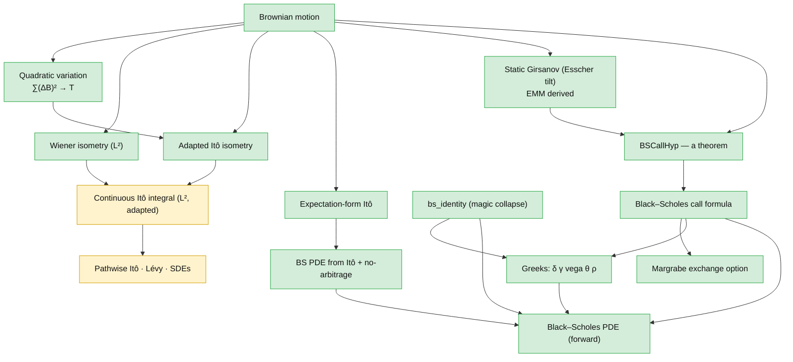

# Blueprint — the deductive spine

How option-pricing theory is built here, starting from Brownian motion: the
risk-neutral measure is *derived* (not assumed), the Black–Scholes formula and
PDE follow, and the point where the continuous Itô integral becomes the next
gate is marked precisely.

This is the spine — the load-bearing arc. The other ~200 results (the full Greek
matrix, fixed income, portfolio theory, risk measures, …) are catalogued with
their faithfulness status in [`coverage.md`](coverage.md).

**Status legend.** ✅ machine-checked in Lean 4, and — for the headline nodes —
`#print axioms`-clean ([`AxiomAudit.lean`](../QuantFin/AxiomAudit.lean) build-pins
them to `[propext, Classical.choice, Quot.sound]`). ⏳ stated but not yet
formalized — the Mathlib-gated frontier. No node is colored proved unless it is.

---

## Foundations

### Brownian motion ✅ *(upstream)*
The driving noise: a process with independent, stationary, Gaussian increments,
`B t ~ N(0, t)`. Taken from Rémy Degenne's
[`brownian-motion`](https://github.com/RemyDegenne/brownian-motion) package
(`IsPreBrownian`), on which this library builds.

### Quadratic variation ✅
`∑ (B_{t_{k+1}} − B_{t_k})² → T` as the partition refines — in **L²**
(`tendsto_qv`) and **in probability** (`tendstoInMeasure_qv`).
→ *Finance:* realized variance accumulates linearly in time at unit rate — the
root of the "volatility² · time" that pervades pricing.
[`Foundations/QuadraticVariationL2.lean`](../QuantFin/Foundations/QuadraticVariationL2.lean)

### Wiener isometry (L²) ✅
For **deterministic** step integrands, `E[(∫ φ dB)²] = ∫ φ² dt`
(`wiener_assembly_isometry`, `wienerIntegralLp_integral_sq`); step functions are
dense (`stepAssembly_denseRange`), giving the L² Wiener integral.
→ *Finance:* the L² geometry of payoffs built from a fixed (non-reacting)
position in Brownian noise.
[`Foundations/WienerIntegralL2.lean`](../QuantFin/Foundations/WienerIntegralL2.lean)

### Adapted Itô isometry ✅
The genuinely stochastic version: for **random adapted** simple integrands,
`E[(∑ φₖ ΔBₖ)²] = ∑ E[φₖ²] Δtₖ` (`ito_isometry_discrete`). The cross terms vanish
by the **weak Markov property** (`integral_cross_increment_bilinear_eq_zero`) —
the distinction that separates Itô from Wiener — with the `∫ B dB` capstone
(`ito_isometry_brownian_self`).
→ *Finance:* a self-financing strategy whose position reacts to the path still
has variance equal to the sum of its per-period variances.
[`Foundations/ItoIsometryAdapted.lean`](../QuantFin/Foundations/ItoIsometryAdapted.lean)

### Expectation-form Itô / Feynman–Kac ✅
`E[f(Bₜ)] = f(0) + ½ ∫₀ᵗ E[f''(Bₛ)] ds` (`expectation_ito`,
`expectation_ito_isPreBrownian`), proved via the heat equation
(`heatConvolution_eq_add_integral_deriv`, `feynmanKac_boundary`).
→ *Finance:* how the expected value of a function of the asset evolves — the
`½σ²` second-order term that drives the Black–Scholes PDE.
[`Foundations/FeynmanKacHeatEquation.lean`](../QuantFin/Foundations/FeynmanKacHeatEquation.lean)

## Change of measure — the centerpiece

### Static Girsanov via an Esscher tilt ✅
Tilting the physical Gaussian by an Esscher (exponential) density
(`gaussianReal_withDensity_esscher`, `hasLaw_esscher_tilt`) yields an *equivalent
probability measure* (`esscherTilt_isProbabilityMeasure`) under which the
discounted asset is a martingale and the call price is the discounted
risk-neutral expectation (`bs_call_formula_of_physical`).
→ *Finance:* **the risk-neutral measure is not an axiom — it is constructed from
the physical measure.** `BSCallHyp` stops being a hypothesis.
[`Foundations/GaussianGirsanov.lean`](../QuantFin/Foundations/GaussianGirsanov.lean)

### BSCallHyp from a Brownian model ✅
A concrete Brownian-driven physical model produces the pricing hypothesis
directly (`BSCallHyp.of_isPreBrownian`, `bsTerminal_via_brownian`) — the second
route into `BSCallHyp`.
[`Foundations/BSCallHypFromBrownian.lean`](../QuantFin/Foundations/BSCallHypFromBrownian.lean)

## Pricing

### Black–Scholes call formula ✅
Under `BSCallHyp`, the call price is `S₀ Φ(d₁) − K e^{−rT} Φ(d₂)`
(`bs_call_formula`).
→ *Finance:* the option price.
[`BlackScholes/Call.lean`](../QuantFin/BlackScholes/Call.lean)

### `bs_identity` — the magic collapse ✅
The algebraic identity `S · φ(d₁) = K e^{−rτ} · φ(d₂)` (`bs_identity`) that makes
the pdf cross-terms cancel. It depends only on the `d₁`/`d₂` definitions and the
Gaussian density — a self-contained algebraic input, so it is a *root* in the
graph above (nothing in the spine proves it); it feeds the Greeks and the PDE.
→ *Finance:* the cancellation behind every clean Greek formula.
[`BlackScholes/PDE.lean`](../QuantFin/BlackScholes/PDE.lean)

### Greeks ✅
δ (`hasDerivAt_bsV_S`), γ (`hasDerivAt_bsV_SS`), vega (`hasDerivAt_bsV_sigma`),
θ (`hasDerivAt_bsV_t`), ρ (`hasDerivAt_bsV_r`) — each derived through
`bs_identity`.
→ *Finance:* the hedging sensitivities.
[`BlackScholes/PDE.lean`](../QuantFin/BlackScholes/PDE.lean)

### Black–Scholes PDE ✅
`bsV` satisfies the Black–Scholes PDE (`bs_pde_holds`), verified from the closed
form via the Greeks and `bs_identity`.
[`BlackScholes/PDE.lean`](../QuantFin/BlackScholes/PDE.lean)

### BS PDE from no-arbitrage + Itô ✅
The same PDE emerges from the Itô drift and a no-arbitrage argument
(`bs_pde_from_no_arbitrage`, `bsItoDrift`) — the dynamic-hedging derivation,
meeting the closed-form route at the PDE.
[`BlackScholes/PDEFromIto.lean`](../QuantFin/BlackScholes/PDEFromIto.lean)

### Margrabe exchange option ✅
The option to exchange one asset for another prices as a Black–Scholes call on
the ratio, with effective volatility `√(σ₁² + σ₂² − 2ρσ₁σ₂)`
(`margrabe_price_of_gaussian`, `margrabe_bsCallHyp_of_gaussian`,
`normalizedSpread_hasLaw_std`) — the multivariate corollary.
[`BlackScholes/MargrabeGrounding.lean`](../QuantFin/BlackScholes/MargrabeGrounding.lean)

## The frontier ⏳

These are stated honestly as **not yet formalized**, gated on Mathlib
infrastructure. See [`roadmap.md`](roadmap.md).

- **Continuous-time L²-adapted Itô integral** — the Cauchy completion of adapted
  simple integrands, consuming both the Wiener and adapted-isometry layers above.
  The next gate.
- **Pathwise Itô's lemma, Lévy's characterization, SDE existence/uniqueness,
  dynamic Girsanov** — downstream of the continuous integral.

---

*This page is the lightweight blueprint: a GitHub-native dependency graph linking
each statement to its Lean proof. For the per-theorem faithfulness audit see
[`coverage.md`](coverage.md); for the storefront and build instructions see the
[README](../README.md).*
