# Blueprint — the deductive spine

How option-pricing theory is built here, starting from Brownian motion: the
risk-neutral measure is *derived* (not assumed), the Black–Scholes formula and
PDE follow, and the point where the pathwise Itô / SDE layer becomes the next
gate is marked precisely.

This is the spine — the load-bearing arc. The other ~200 results (the full Greek
matrix, fixed income, portfolio theory, risk measures, …) are catalogued with
their faithfulness status in [`coverage.md`](coverage.md).

**Status legend.** Green: machine-checked in Lean 4, and — for the headline
nodes — `#print axioms`-clean ([`AxiomAudit.lean`](../MathFin/AxiomAudit.lean)
build-pins them to `[propext, Classical.choice, Quot.sound]`). Blue: consumed
from an upstream package (Degenne's `brownian-motion`) — coherence made
visible. 🚧 *partially* formalized — a genuine machine-checked core with an
explicitly deferred lifting step (the gap is named in the file, never papered
over). ⏳ stated but not yet formalized — the Mathlib-gated frontier. No node
is colored proved unless it is.

**The graph below is generated, not drawn.** Nodes are `@[blueprint]`-tagged
declarations ([`MathFin/Blueprint.lean`](../MathFin/Blueprint.lean)); edges are
*inferred from the proof terms* (LeanArchitect's `collectUsed`, a transitive
walk that passes through untagged helpers and stops at tagged constants —
[`MathFin/Blueprint/Export.lean`](../MathFin/Blueprint/Export.lean) →
[`tools/blueprint_render.py`](../tools/blueprint_render.py)). An edge here is
a theorem actually *consuming* another — narrative lineage with no proof-term
trace does not appear, and where this page's prose once disagreed with the
graph, the graph won (see *Black–Scholes PDE* below). A node with no inbound
edge is a genuine logical root.

```mermaid
graph TD
  brownianMotion["Brownian motion (Degenne, upstream)"]:::upstream
  binomialRepresentation["Binomial martingale representation (completeness)"]:::proved
  bsCall["Black–Scholes call formula"]:::proved
  bsIdentity["bs_identity: S·φ(d₁) = Ke^{−rτ}·φ(d₂)"]:::proved
  bsPde["Black–Scholes PDE (from the closed form)"]:::proved
  bsPdeNoArb["BS PDE ↔ Itô-drift balance (algebraic)"]:::proved
  carrMadan["Carr–Madan static replication"]:::proved
  crrBsConvergence["CRR → Black–Scholes convergence"]:::proved
  discreteIto["Discrete Itô formula (pathwise)"]:::proved
  esscherTilt["Esscher tilt is the Gaussian Girsanov"]:::proved
  expectationIto["Expectation-form Itô / Feynman–Kac"]:::proved
  feynmanKacHeatEq["Heat equation for the kernel convolution"]:::proved
  gbmSde["GBM coefficient matching (algebraic)"]:::proved
  markovPathLaw["Markov path law (Ionescu–Tulcea)"]:::proved
  itoIntegralClm["Continuous Itô integral (CLM on [0,T])"]:::proved
  bsDelta["Greeks (δ shown; γ vega θ ρ alongside)"]:::proved
  bsPdeFeynmanKac["Black–Scholes PDE (from Feynman–Kac)"]:::proved
  bscallhypBrownian["BSCallHyp from a Brownian model"]:::proved
  continuousFtap["Continuous-time first FTAP (EMM)"]:::proved
  girsanovCall["Call price from the physical measure"]:::proved
  itoIsometryAdapted["Adapted Itô isometry"]:::proved
  margrabe["Margrabe exchange option"]:::proved
  quadraticVariation["Quadratic variation: ∑(ΔB)² → T in L²"]:::proved
  wienerIsometry["Wiener isometry (deterministic L²)"]:::proved
  itoFormulaL2["Itô formula, L² (C³ bounded — Summit A)"]:::proved
  itoFormulaTdL2["Time-dependent Itô formula, L² (Summit A′)"]:::proved
  itoSquaredL2["Itô for x² in L²: ∑B·ΔB → ½(B_T²−B₀²−T)"]:::proved
  mertonDominance["Merton dominance: jump risk is never free"]:::proved
  itoIntegralBrownian["∫₀ᵀ B dB = ½(B_T² − B₀² − T)"]:::proved
  pathwiseIto["Pathwise Itô · Lévy · SDEs"]:::gated

  brownianMotion --> itoIntegralClm
  bsIdentity --> bsDelta
  bsCall --> bsPdeFeynmanKac
  feynmanKacHeatEq --> bsPdeFeynmanKac
  brownianMotion --> bscallhypBrownian
  brownianMotion --> continuousFtap
  bsCall --> girsanovCall
  esscherTilt --> girsanovCall
  brownianMotion --> itoIsometryAdapted
  bsCall --> margrabe
  esscherTilt --> margrabe
  brownianMotion --> quadraticVariation
  brownianMotion --> wienerIsometry
  brownianMotion --> itoFormulaL2
  itoIntegralClm --> itoFormulaL2
  discreteIto --> itoFormulaL2
  brownianMotion --> itoFormulaTdL2
  itoIntegralClm --> itoFormulaTdL2
  brownianMotion --> itoSquaredL2
  discreteIto --> itoSquaredL2
  quadraticVariation --> itoSquaredL2
  bsCall --> mertonDominance
  bsDelta --> mertonDominance
  bsIdentity --> mertonDominance
  brownianMotion --> itoIntegralBrownian
  itoIntegralClm --> itoIntegralBrownian
  itoIsometryAdapted --> itoIntegralBrownian
  itoSquaredL2 --> itoIntegralBrownian
  itoIntegralClm --> pathwiseIto
  itoFormulaL2 --> pathwiseIto

  classDef proved fill:#d4edda,stroke:#28a745,color:#111;
  classDef upstream fill:#d9e8f6,stroke:#1f6fb2,color:#111;
  classDef partial fill:#ffe5d0,stroke:#d9534f,color:#111;
  classDef gated fill:#fff3cd,stroke:#d39e00,color:#111;
```

<!-- BEGIN GENERATED SPINE (tools/blueprint_render.py — do not hand-edit) -->

<!-- END GENERATED SPINE -->

---

## Foundations

### Brownian motion ✅ *(upstream)*
The driving noise: a process with independent, stationary, Gaussian increments,
`B t ~ N(0, t)`. Taken from Rémy Degenne's
[`brownian-motion`](https://github.com/RemyDegenne/brownian-motion) package
(`IsPreBrownian`), on which this library builds.

### Quadratic variation ✅
`∑ (B_{t_{k+1}} − B_{t_k})² → T` as the partition refines — in **L²**
(`tendsto_qv`) and **in probability** (`tendstoInMeasure_qv`).
→ *Finance:* realized variance accumulates linearly in time at unit rate — the
root of the "volatility² · time" that pervades pricing.
[`Foundations/QuadraticVariationL2.lean`](../MathFin/Foundations/QuadraticVariationL2.lean)

### Wiener isometry (L²) ✅
For **deterministic** step integrands, `E[(∫ φ dB)²] = ∫ φ² dt`
(`wiener_assembly_isometry`, `wienerIntegralLp_integral_sq`); step functions are
dense (`stepAssembly_denseRange`), giving the L² Wiener integral.
→ *Finance:* the L² geometry of payoffs built from a fixed (non-reacting)
position in Brownian noise.
[`Foundations/WienerIntegralL2.lean`](../MathFin/Foundations/WienerIntegralL2.lean)

### Adapted Itô isometry ✅
The genuinely stochastic version: for **random adapted** simple integrands,
`E[(∑ φₖ ΔBₖ)²] = ∑ E[φₖ²] Δtₖ` (`ito_isometry_discrete`). The cross terms vanish
by the **weak Markov property** (`integral_cross_increment_bilinear_eq_zero`) —
the distinction that separates Itô from Wiener — with the `∫ B dB` capstone
(`ito_isometry_brownian_self`).
→ *Finance:* a self-financing strategy whose position reacts to the path still
has variance equal to the sum of its per-period variances.
[`Foundations/ItoIsometryAdapted.lean`](../MathFin/Foundations/ItoIsometryAdapted.lean)

### Continuous Itô integral as a CLM on `[0,T]` ✅
The discrete Itô isometry (`assembly_isometry`) extended to a continuous linear
isometry `itoIntegralCLM_T : Lp ℝ 2 (timeMeasure_T ⊗ μ).trim 𝓕.predictable →L[ℝ]
Lp ℝ 2 μ` with `itoIntegralCLM_T_norm`. Density of T-bounded simple processes
(`simpleAssembly_T_denseRange`) is proved by Dynkin's π-λ theorem on the basic
predictable rectangles (`isPiSystem_predictableRect`,
`generateFrom_predictableRect`), reducing orthogonality to `∫_R g dμ = 0` for
every basic rect `R = (a, b] × F` with `F ∈ ℱ_a`, then to all measurable sets
via `setIntegral_eq_zero_of_orthogonal_pred`, and finally to `g = 0` via
`Lp.ae_eq_zero_of_forall_setIntegral_eq_zero`. The CLM falls out of
`LinearMap.extendOfNorm`. Its first genuine consumer is
`itoIntegralCLM_T_brownian`: `∫₀ᵀ B dB = ½(B_T² − B₀² − T)` *through the CLM* —
bridging the abstract integral to the concrete quadratic-variation limit, and
itself the template (clamp-truncation + isometry-Cauchy completion) any
unbounded-coefficient consumer would reuse.
→ *Finance:* the analytic foundation for the Itô calculus layer — every
predictable `L²` integrand on `[0, T]` has a well-defined Itô integral with
the isometry norm identity, the bedrock of SDE existence/uniqueness and the
Black–Scholes PDE derivation downstream.
[`Foundations/ItoIntegralCLM.lean`](../MathFin/Foundations/ItoIntegralCLM.lean)

### Itô's lemma — discrete pathwise core + continuous `x²` L² form ✅
The exact pathwise identity `f(X_N) − f(X_0) = ∑ f′(X_k)ΔX_k + ½∑ f″(X_k)(ΔX_k)²
+ ∑ R_k` (`discrete_ito_formula`), with the Taylor remainder `R_k` computed in
closed form for the keystone polynomials: `x²` (remainder `0`,
`discrete_squaring_identity`), `x³` (`discrete_cubing_identity`), `x⁴`. The
**continuous L² form** for `x²`: along the uniform partition, the Riemann sums
`∑ B·ΔB → ½(B_T² − B_0² − T)` in `L²(μ)` (`itoSquared_L2_tendsto_div2`), one
algebraic step from the discrete identity + the `L²` quadratic variation
`tendsto_qv`. The **time-dependent 2D** formula (`discrete_ito_formula_2d`,
`itoDrift2D`) carries the `∂_t f · Δt` term.
→ *Finance:* the `B_t² = 2∫B dB + t` keystone behind variance-swap pricing
and Doob's stochastic-integral definition.
[`Foundations/ItoSquaringIdentity.lean`](../MathFin/Foundations/ItoSquaringIdentity.lean),
[`Foundations/DiscreteItoPolynomial.lean`](../MathFin/Foundations/DiscreteItoPolynomial.lean),
[`Foundations/ItoFormulaSquaredL2.lean`](../MathFin/Foundations/ItoFormulaSquaredL2.lean),
[`Foundations/ItoLemma2D.lean`](../MathFin/Foundations/ItoLemma2D.lean)

### Geometric Brownian motion — SDE coefficient matching 🚧
Two honestly-distinct layers, NOT a continuous SDE-solution theorem:
* **Genuine (full):** the partials of `S(t, x) = S₀·exp((μ − ½σ²)t + σx)` are
  real `HasDerivAt` derivations from the `Real.exp` chain rule —
  `hasDerivAt_gbmValue_space` (`∂_x = σS`), `_time` (`∂_t = (μ−½σ²)S`),
  `_space_space` (`∂_xx = σ²S`).
* **Coefficient matching (algebraic):** `gbm_solves_sde` takes those partials as
  `HasDerivAt` hypotheses (so `HasDerivAt.unique` *forces* them to the genuine
  derivatives) and shows the 2D Itô drift under the Brownian generator
  `(0, 1)` is `μ·S` with diffusion `σ·S` — i.e. `S(t, B_t)` matches the Itô
  coefficients of `dS = μS dt + σS dB`. The `−½σ²` exponent cancels the `+½σ²`
  Itô term — that cancellation *is* the Itô correction.

What is **deferred** — and why it is *deferral, not absence*: the continuous-time
partition-limit Itô formula now **exists** as Summit A (`ito_formula_L2_bddDeriv`,
the L² Itô formula for `C³` functions with *bounded* derivatives), but it does not
directly reach GBM, whose exponential has *unbounded* derivatives. Bridging the
engine to GBM needs an unbounded-coefficient lift — a second keystone in the shape
of `itoIntegralCLM_T_brownian` (clamp-truncation + a martingale-difference L²
limit `∑ σM_{t_k} ΔB → M_T − 1`), or Summit-C localization. This is **deliberately
not built**: the operational result it would prove — *the discounted GBM is a
`Q`-martingale* — is already established directly via the Wald exponential
(`discountedGBM_isMartingale`; see *Continuous-time first FTAP* below). The lift
would buy an alternative *derivation route* to a theorem we already hold, not a new
result, so it is a poor trade against ~400 lines of parallel keystone.

The BS PDE is *routed* through the shared drift — `bs_pde_eq_itoDrift2D_minus_rV`:
`BS-PDE-LHS = itoDrift2D V_t V_S V_SS (rS) (σS) − rV` is a **polynomial
identity** — but deriving "drift `= 0`" *from* a no-arbitrage `Q`-martingale is
deferred (not yet proved). The win is structural: the BS coefficient is one
instance of the general `itoDrift2D`, not a bespoke algebra.
→ *Finance:* the asset dynamics underlying every BS-family closed form — the
genuine GBM derivatives in hand, the SDE-solution limit still to come.
[`Foundations/ItoLemma2D.lean`](../MathFin/Foundations/ItoLemma2D.lean),
[`BlackScholes/PDEFromIto.lean`](../MathFin/BlackScholes/PDEFromIto.lean)

### Expectation-form Itô / Feynman–Kac ✅
`E[f(Bₜ)] = f(0) + ½ ∫₀ᵗ E[f''(Bₛ)] ds` (`expectation_ito`,
`expectation_ito_isPreBrownian`), proved via the heat equation
(`heatConvolution_eq_add_integral_deriv`, `feynmanKac_boundary`).
→ *Finance:* how the expected value of a function of the asset evolves — the
`½σ²` second-order term that drives the Black–Scholes PDE.
[`Foundations/FeynmanKacHeatEquation.lean`](../MathFin/Foundations/FeynmanKacHeatEquation.lean)

### Feynman–Kac heat flow — kernel-side derivatives ✅
The kernel convolution `feynmanU g t x = ∫ z, g z · K(t, z − x) dz`, with the
heat kernel **jointly Fréchet-differentiable** (`hasFDerivAt_heatKernel` — the
one genuinely-2D ingredient), giving `∂_t/∂_x/∂_xx` of `feynmanU` by dominated
differentiation under the integral, and the heat equation `∂_t U = ½ ∂_xx U`
(`feynmanU_heat_equation`) for sub-Gaussian payoffs.
→ *Finance:* the heat flow whose discounted log-transform *is* the
Black–Scholes price surface — the analytic engine of the FK keystone (Pricing
section below).
[`Foundations/FeynmanKacHeatEquation.lean`](../MathFin/Foundations/FeynmanKacHeatEquation.lean)

### Markov path law (Ionescu–Tulcea) ✅
The law of a countable-state Markov chain constructed on path space via
`Kernel.trajMeasure`, with the finite-cylinder factorization through the
transition kernels (`markovPathMeasure_cylinder`) — proved by comp-product
marginal induction, not assumed.
→ *Finance:* the path-space measure underlying lattice/tree models — every
discrete pricing tree is a Markov path law.
[`Foundations/MarkovPathMeasure.lean`](../MathFin/Foundations/MarkovPathMeasure.lean)

## Change of measure — the centerpiece

### Static Girsanov via an Esscher tilt ✅
Tilting the physical Gaussian by an Esscher (exponential) density
(`gaussianReal_withDensity_esscher`, `hasLaw_esscher_tilt`) yields an *equivalent
probability measure* (`esscherTilt_isProbabilityMeasure`) under which the
discounted asset is a martingale and the call price is the discounted
risk-neutral expectation (`bs_call_formula_of_physical`).
→ *Finance:* **the risk-neutral measure is not an axiom — it is constructed from
the physical measure.** `BSCallHyp` stops being a hypothesis.
[`Foundations/GaussianGirsanov.lean`](../MathFin/Foundations/GaussianGirsanov.lean)

### BSCallHyp from a Brownian model ✅
A concrete Brownian-driven physical model produces the pricing hypothesis
directly (`BSCallHyp.of_isPreBrownian`, `bsTerminal_via_brownian`) — the second
route into `BSCallHyp`.
[`Foundations/BSCallHypFromBrownian.lean`](../MathFin/Foundations/BSCallHypFromBrownian.lean)

### Continuous-time first FTAP — discounted price is a `Q`-martingale ✅
Under the risk-neutral measure, the discounted Black–Scholes price
`e^{−rt} S_t = S₀ · exp(σ X_t − σ² t / 2)` is a continuous-time martingale w.r.t.
the Brownian filtration (`discountedGBM_isMartingale`) — the defining property of
the equivalent martingale measure, and the operational content of the first FTAP
in continuous time. It falls out *directly* from the **Wald exponential
martingale** (`IsFilteredPreBrownian.waldExponential_isMartingale`), with no
stochastic-integral machinery: the `− σ² t / 2` correction is exactly what makes
the conditional mean of the increment one. This is *why* the engine→GBM
Itô-representation bridge (see *Geometric Brownian motion* above) is deferral, not
a gap — the martingale property is already in hand.
→ *Finance:* the continuous-time EMM property — the discounted price is a fair
game under `Q`, the bedrock of arbitrage-free pricing.
[`Foundations/ContinuousFTAP.lean`](../MathFin/Foundations/ContinuousFTAP.lean)

## Pricing

### Black–Scholes call formula ✅
Under `BSCallHyp`, the call price is `S₀ Φ(d₁) − K e^{−rT} Φ(d₂)`
(`bs_call_formula`).
→ *Finance:* the option price.
[`BlackScholes/Call.lean`](../MathFin/BlackScholes/Call.lean)

### `bs_identity` — the magic collapse ✅
The algebraic identity `S · φ(d₁) = K e^{−rτ} · φ(d₂)` (`bs_identity`) that makes
the pdf cross-terms cancel. It depends only on the `d₁`/`d₂` definitions and the
Gaussian density — a self-contained algebraic input, so it is a *root* in the
graph above (nothing in the spine proves it); it feeds the Greeks and the PDE.
→ *Finance:* the cancellation behind every clean Greek formula.
[`BlackScholes/PDE.lean`](../MathFin/BlackScholes/PDE.lean)

### Greeks ✅
δ (`hasDerivAt_bsV_S`), γ (`hasDerivAt_bsV_SS`), vega (`hasDerivAt_bsV_sigma`),
θ (`hasDerivAt_bsV_t`), ρ (`hasDerivAt_bsV_r`) — each derived through
`bs_identity`.
→ *Finance:* the hedging sensitivities.
[`BlackScholes/PDE.lean`](../MathFin/BlackScholes/PDE.lean)

### Black–Scholes PDE ✅
`bsV` satisfies the Black–Scholes PDE (`bs_pde_holds`). *Correction recorded
2026-06-06, forced by the generated graph:* this page used to say "verified via
the Greeks and `bs_identity`" — the proof term shows otherwise. The PDE
statement carries the Greeks' closed forms in its slots, and the verification
is self-contained field algebra (`rw [bsV]; field_simp; ring`); it consumes
neither the Greek theorems nor `bs_identity`. The conceptual route Greeks →
PDE is real mathematics but a *different proof* than the one formalized; the
graph shows `thm:bs-pde` as a root, and that is the truth.
[`BlackScholes/PDE.lean`](../MathFin/BlackScholes/PDE.lean)

### BS PDE from no-arbitrage + Itô 🚧
The PDE is shown *algebraically equal* to the Itô-drift balance: the iff
`bsItoDrift − rV = 0 ↔ BS-PDE` (`bs_pde_from_no_arbitrage`) and the routing
`BS-PDE-LHS = itoDrift2D (rS) (σS) − rV` (`bs_pde_eq_itoDrift2D_minus_rV`) are
both polynomial identities (`ring`). What is **deferred**: deriving "drift `= 0`"
*from* a no-arbitrage `Q`-martingale (the dynamic-hedging derivation proper). The
bounded-derivative Itô formulas do not reach it: the *time-dependent* formula
now exists (`sc-thm-7.1.2`, `full` in the bounded regime — Summit A′ below),
but the BS value function's `Γ` is unbounded as `S → 0`, so the bounded formula
does not yet apply to it. So this meets the closed-form route at the PDE
*coefficient*, with the martingale step still to come. An *independent*
probabilistic derivation of the PDE — via Feynman–Kac rather than Itô — is
complete: next section.
[`BlackScholes/PDEFromIto.lean`](../MathFin/BlackScholes/PDEFromIto.lean)

### BS PDE from Feynman–Kac ✅
The keystone `bsV_satisfies_bs_pde_via_feynmanKac`: the Black–Scholes PDE
`−∂_τV + ½σ²S²∂_SSV + rS∂_SV − rV = 0` derived **independently of Itô** from
the representation `bsV = e^{−rτ} · feynmanU` (the discounted heat flow,
`bsV_eq_discount_feynmanU`), the FK Greeks `hasDerivAt_bsV_{tau,S,SS}_fk`, and
the kernel heat equation — the exact drift cancellation (`U_x` coefficient
`−(r−σ²/2)−½σ²+r = 0`, `U_xx` coefficient `−½σ²+½σ²=0`) assembles the
operator. A *second, independent* derivation of the PDE (the closed-form check
above is the first); the Itô/martingale route remains open.
→ *Finance:* the PDE obtained from the risk-neutral expectation representation
— Feynman–Kac as practitioners actually use it.
[`BlackScholes/PDEFromFeynmanKac.lean`](../MathFin/BlackScholes/PDEFromFeynmanKac.lean)

### Itô formula in L² — Summit A ✅
The continuous-time L² Itô formula
`f(B_T) − f(B_0) = ∫₀ᵀ f′(B_s) dB_s + ½∫₀ᵀ f″(B_s) ds` for `C³` functions with
**bounded** derivatives (`ito_formula_L2_bddDeriv`), proved from primitives:
weighted quadratic variation, the Taylor-remainder limit, and the Riemann↔CLM
bridge — three limit arguments on top of `discrete_ito_formula` and the
continuous Itô integral. The boundedness restriction is the honestly-named
boundary: GBM's exponential sits outside it (see *Geometric Brownian motion*
above for why that lift is deferral, not absence).
→ *Finance:* the engine that turns pathwise second-order algebra into
distributional statements — the analytic heart of every drift argument.
[`Foundations/ItoFormulaCLM.lean`](../MathFin/Foundations/ItoFormulaCLM.lean)

### Time-dependent Itô formula in L² — Summit A′ ✅
The classical `df = f_x dB + (f_t + ½f_xx) dt` in integrated form:
`f(T, B_T) − f(0, B_0) = ∫₀ᵀ f_x(s, B_s) dB_s + ∫₀ᵀ (f_t + ½f_xx)(s, B_s) ds`
for `C^{1,2}` functions with bounded higher partials
(`ito_formula_td_L2_bddDeriv`). The three Summit-A limit arguments redone with
`(t,x)`-dependence: the weighted quadratic variation generalized to bounded
**adapted weight processes** (the fluctuation engine never cared the weight was
`g(B_s)`), the 2D Itô–Taylor remainder vanishing at `O(1/n)` under the Gaussian
moments, and the time-dependent Riemann↔CLM bridge. The joint continuity of
`f_t` is *derived* from its bounded partials (jointly Lipschitz), not assumed;
the boundedness restriction stays the honestly-named boundary, as in Summit A.
→ *Finance:* the form pricing actually uses — value functions depend on time,
and the `f_t + ½f_xx` drift is the Black–Scholes operator itself.
[`Foundations/ItoFormulaTD.lean`](../MathFin/Foundations/ItoFormulaTD.lean)

### CRR → Black–Scholes convergence ✅
The binomial (CRR) call price converges to the Black–Scholes call price as the
tree refines (`binomialPrice_call_tendsto_bs`): characteristic functions →
Lévy continuity → convergence in distribution, with **put–call parity lifting
the bounded put's weak convergence to the call** (avoiding a uniform-
integrability/Vitali argument). The discrete and continuous pricing theories
meet where they should.
→ *Finance:* the lattice methods used on every trading desk are not a separate
model — they are the same price, in the limit.
[`Binomial/CRRCharFun.lean`](../MathFin/Binomial/CRRCharFun.lean)

### Margrabe exchange option ✅
The option to exchange one asset for another prices as a Black–Scholes call on
the ratio, with effective volatility `√(σ₁² + σ₂² − 2ρσ₁σ₂)`
(`margrabe_price_of_gaussian`, `margrabe_bsCallHyp_of_gaussian`,
`normalizedSpread_hasLaw_std`) — the multivariate corollary.
[`BlackScholes/MargrabeGrounding.lean`](../MathFin/BlackScholes/MargrabeGrounding.lean)

### Carr–Madan static replication — spanning formula ✅
Any twice-differentiable payoff `f` decomposes, around a reference level `κ`, as cash, a
forward, and a static book of out-of-the-money options weighted by its convexity `f''`:
`f S = f κ + f' κ·(S − κ) + ∫_L^κ f''(K)·(K − S)⁺ dK + ∫_κ^U f''(K)·(S − K)⁺ dK`
(`carrMadan_spanning`, the honest compact strike-range form). One integration by parts — the
second-order Taylor remainder `∫_κ^S (S−t) f''(t) dt = f S − f κ − f' κ (S−κ)` — plus a case
split in which each option leg's positive part either vanishes or reproduces the remainder. The
log payoff specialises to the **variance-swap log-contract** (`carrMadan_log_spanning`):
`−1/K²`-weighted strips of OTM puts and calls.
→ *Finance:* model-free static replication — every European claim is a portfolio of vanilla
options, and the `1/K²` density is exactly what a variance swap holds.
[`Foundations/CarrMadan.lean`](../MathFin/Foundations/CarrMadan.lean)

### Binomial martingale representation — market completeness ✅
On the binomial tree (coin-flip paths, with the node-wise risk-neutral condition
`q·X^U + (1−q)·X^D = X` — the explicit binomial conditional expectation), every martingale `M`
is the discrete stochastic integral of a **predictable** hedge against the discounted asset:
`M_N = M_0 + ∑_{k<N} H_k·(S_{k+1} − S_k)` (`binomial_martingale_representation`). The hedge is
the node-wise delta `H = ΔM/ΔS`, predictable because it is fixed *before* the next flip is
revealed; the proof is purely algebraic and pathwise (no measure theory), telescoping the
one-step identity. The discrete companion of the abstract martingale-transform converse
(`Foundations/MartingaleTransform.lean`).
→ *Finance:* **completeness** — the second pillar of the FTAP: every contingent claim is
replicable by a self-financing strategy, so the risk-neutral price is the *unique* arbitrage-free
price.
[`Binomial/MartingaleRepresentation.lean`](../MathFin/Binomial/MartingaleRepresentation.lean)

### Merton jump-diffusion dominance ✅
Jump risk is never free: the Black–Scholes price is dominated by the Merton
(1976) jump-diffusion price, `bsV ≤ mertonCallPrice`
(`bsV_le_mertonCallPrice`), through two channels — vega (per-term vol
widening) and gamma/Jensen (the mixture over jump counts, with the tangent's
linear term killed by `integral_mertonSpot`); the classic `Λ′ = Λ(1+k)`
weights display is `MertonClassicDisplay`.
→ *Finance:* ignoring jumps *underprices* options — the model-risk inequality,
as a theorem.
[`BlackScholes/MertonDominance.lean`](../MathFin/BlackScholes/MertonDominance.lean)

## The frontier ⏳

These are stated honestly as **not yet formalized**, gated on Mathlib
infrastructure. See [`roadmap.md`](roadmap.md).

- **Pathwise Itô's lemma, Lévy's characterization, SDE existence/uniqueness,
  dynamic Girsanov** — downstream of the (built) `[0,T]` continuous Itô integral;
  this is the next gate. The infinite-horizon `L2Predictable` variant of the
  integral itself also remains open — see
  [`ito-integral-clm-deferred.md`](ito-integral-clm-deferred.md).

---

*This page is the lightweight blueprint: a GitHub-native dependency graph
linking each statement to its Lean proof. The graph regenerates from the
proof terms — inside the verify container:
`lake build MathFin.Blueprint blueprint_export && lake exe blueprint_export
MathFin.Blueprint > docs/blueprint_nodes.json`, then host-side
`python3 tools/blueprint_render.py`. For the per-theorem faithfulness audit
see [`coverage.md`](coverage.md); for the storefront and build instructions
see the [README](../README.md).*
